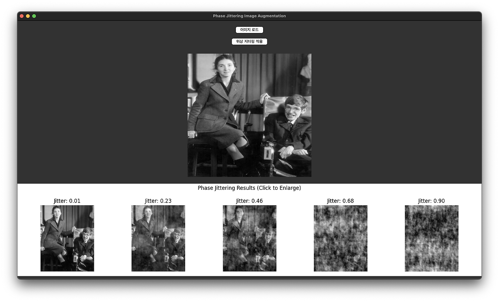

# Phase Jittering Image Augmentation

A Python application for applying phase jittering as a spectral augmentation technique for image processing.



## Overview

This application uses Fourier transform to manipulate the phase component of images, creating unique augmentations by randomly perturbing the phase spectrum. Phase jittering is a spectral-domain augmentation technique that preserves the amplitude spectrum while modifying the phase information.

## Features

- Load grayscale images in various formats (PNG, JPG, JPEG, BMP, GIF, TIFF)
- Apply phase jittering with adjustable intensity levels
- Visualize multiple jittering results simultaneously
- Interactive interface to examine augmentation results
- Click on any augmented image to see an enlarged view

## How It Works

1. The image is converted to grayscale and transformed to the frequency domain using Fast Fourier Transform (FFT)
2. Random phase perturbations are applied to the frequency representation
3. The modified frequency representation is transformed back to the spatial domain
4. The result is normalized to maintain proper image contrast

## Technical Implementation

The core transformation process follows these steps:
```python
# Apply phase jittering to the frequency-domain representation
phase_random = np.exp(1j * 2 * np.pi * np.random.rand(*f_shift.shape) * jitter_amount)
f_jittered = f_shift * phase_random
f_ishift = np.fft.ifftshift(f_jittered)
img_jittered = np.fft.ifft2(f_ishift)
img_jittered = np.abs(img_jittered)

# Normalize the result
img_jittered = (img_jittered - np.min(img_jittered)) / (np.max(img_jittered) - np.min(img_jittered))
```

## Requirements

- Python 3.x
- tkinter
- PIL (Pillow)
- NumPy
- Matplotlib

## Usage

1. Run the application: `python phase_jittering.py`
2. Click "이미지 로드" to select an image
3. Click "위상 지터링 적용" to apply phase jittering
4. Click on any of the resulting thumbnails to view an enlarged version

## Applications

Phase jittering can be useful for:
- Data augmentation in machine learning
- Creating artistic effects
- Testing robustness of image processing algorithms
- Simulating distortion effects

## License

MIT
